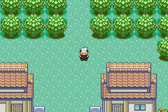

# pokeemerald branches

This is a feature branch repo for [pret's](https://pret.github.io/) pokeemerald decomp.

# Branches

## bsbob_map_popups

- This is a port of BSBob's map pop-ups from [Vanadium Version](https://github.com/nielsmittertreiner/pokeemerald/tree/vanadium). If you pull this, please credit him.
- `map_name_popup.h` has configs for alpha blending the pop-ups as well as displaying 24 hour time on the clock.
- You can easily add additional pop-up themes by doing the following:
    1. Add your primary (top) pop-up image, secondary (bottom) pop-up image, and palette to the `graphics/map_popup/` folder.
    2. In `map_name_popup.c`, add the theme to the `MapPopUp_Themes` enum.
    3. Next, add your images and palettes with their file path following the example of the black theme right above `sRegionMapSectionId_To_PopUpThemeIdMapping`.
    4. Finally, add your theme to the `switch` statement in `LoadMapNamePopUpWindowBgs(void)`.
    5. Now just assign your theme to any map section you want it to be used for.

